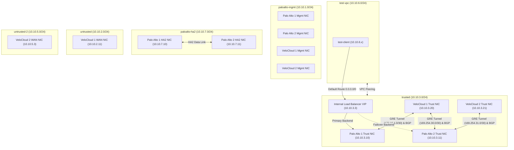

# Project Architecture Document: GCP GRE Tunnel & SD-WAN Integration

This document outlines the system architecture, network design, and configuration details for the GRE Tunnel and SD-WAN integration project. The infrastructure is designed to deploy high-availability virtual firewall appliances (Palo Alto VM-Series NGFW) and SD-WAN Edges (VMware VeloCloud) in Google Cloud Platform (GCP).

---

## 1. System Overview

The primary goal of this architecture is to establish secure, dynamically-routed transit paths between GCP workloads and corporate SD-WAN networks. 
Key architecture components include:
*   **Palo Alto Networks VM-Series Firewalls (NGFW):** Configured in an Active/Passive high-availability cluster to inspect and control transit traffic.
*   **VMware VeloCloud SD-WAN Edges:** Configured as virtual edges to terminate SD-WAN overlays and peer with Palo Alto firewalls.
*   **Logical GRE Tunnels:** Built over the trusted internal GCP network to enable direct IP connectivity between firewalls and SD-WAN Edges.
*   **BGP Dynamic Routing:** Used over the GRE tunnels to automatically exchange routes (e.g., advertise local subnets and propagate a default route).
*   **Internal TCP/UDP Load Balancing (ILB):** Distributes traffic from test workloads to the active Palo Alto firewall and handles seamless failover.

---

## 2. Network Topology & VPC Architecture

The design is segregated into **six (6) separate VPC Networks** to maintain strict security boundaries and management isolation.



### VPC Configurations

1.  **`trusted` VPC (`10.10.3.0/24` subnet):** 
    Acts as the internal transit network where the GRE tunnels are logically built. It connects the Trust data interfaces of the Palo Alto firewalls and the LAN interfaces of the VeloCloud Edges.
2.  **`untrusted` VPC (`10.10.2.0/24` subnet):**
    Serves as the public WAN transit interface for VeloCloud Edge 1.
3.  **`untrusted-2` VPC (`10.10.5.0/24` subnet):**
    Serves as the public WAN transit interface for VeloCloud Edge 2.
4.  **`paloalto-mgmt` VPC (`10.10.1.0/24` subnet):**
    Isolated out-of-band management network for admin access (SSH/HTTPS) to Palo Alto firewalls and VeloCloud Edges.
5.  **`paloalto-ha2` VPC (`10.10.7.0/24` subnet):**
    Dedicated cluster network to handle HA2 (data synchronization and session state replication) between the two Palo Alto appliances.
6.  **`test-vpc` (`10.10.6.0/24` subnet):**
    Workload network containing client VM instances (`test-client`). Peered with the `trusted` VPC using custom route exchange to transit all external and SD-WAN bound traffic through the firewalls.

---

## 3. Appliance & VM Configurations

The virtual appliances are provisioned as Google Compute Engine instances with IP forwarding enabled to support network transit.

### A. Palo Alto VM-Series (NGFW)

Two Palo Alto VM instances (`paloalto-ngfw` and `paloalto-ngfw-2`) are deployed:
*   **Machine Type:** `n1-standard-4` (Required to support multiple network interfaces).
*   **Network Interface Map:**
    *   `nic0`: `trusted` network (`10.10.3.10` / `10.10.3.11`)
    *   `nic1`: `paloalto-mgmt` network with ephemeral public IP for management.
    *   `nic2`: `paloalto-ha2` network (`10.10.7.10` / `10.10.7.11`)
*   **Metadata:**
    *   `mgmt-interface-swap = enable`: Configured to swap GCP standard boot interface `nic0` to act as the internal data/trust interface.
    *   `serial-port-enable = true`: Enabled for out-of-band serial console troubleshooting.

### B. VeloCloud SD-WAN Edges

Two VeloCloud Edges (`velocloud-edge` and `velocloud-edge-2`) are deployed:
*   **Machine Type:** `e2-standard-4`
*   **Network Interface Map (VeloCloud Edge 1):**
    *   `nic0`: `paloalto-mgmt` network (ephemeral public IP)
    *   `nic1` (GE2): `untrusted` network (`10.10.2.11` with public IP for WAN overlay)
    *   `nic2` (GE3): `trusted` network (`10.10.3.20` - internal LAN/GRE transit)
*   **Network Interface Map (VeloCloud Edge 2):**
    *   `nic0`: `paloalto-mgmt` network (ephemeral public IP)
    *   `nic1` (GE2): `untrusted-2` network (`10.10.5.3` with public IP for WAN overlay)
    *   `nic2` (GE3): `trusted` network (`10.10.3.21` - internal LAN/GRE transit)
*   **Metadata:**
    *   `user-data`: Mapped cloud-init files providing the VeloCloud Orchestrator (VCO) target URL and activation codes for bootstrapping.

---

## 4. Load Balancing & High Availability (HA)

An **Internal TCP/UDP Load Balancer (ILB)** handles incoming traffic routing and high availability for the Palo Alto firewalls.

*   **Load Balancing Scheme:** `INTERNAL` (Layer 4 TCP/UDP Load Balancer)
*   **Backend Service:** `paloalto-ilb-backend`
    *   **Primary Backend Group:** `paloalto-group-primary` containing `paloalto-ngfw`.
    *   **Failover Backend Group:** `paloalto-group-secondary` containing `paloalto-ngfw-2`.
*   **Failover Policy:**
    *   `failover_ratio`: `0.0` (Triggers failover immediately when the primary instance becomes unhealthy).
    *   `disable_connection_drain_on_failover`: `false` (Ensures smooth connection failover).
*   **Health Check:** `paloalto-ilb-health-check`
    *   **Protocol:** TCP port `22` (SSH) monitored on the Trust interface (`ethernet1/1`).
    *   **Interval:** 5 seconds, **Timeout:** 5 seconds.
*   **Forwarding Rule:** `paloalto-ilb-forwarding-rule`
    *   Deployed in the `trusted` VPC subnet (`trusted-subnet`).
    *   Handles all internal transit traffic on `all_ports`.

---

## 5. Routing & Traffic Flow Design

Dynamic routing ensures traffic traverses the active firewall and failover transitions seamlessly.

```
[test-client (10.10.6.x)] 
       │
       ▼ (Peered VPC Transit)
[trusted VPC (Default Route to ILB)] 
       │
       ▼ (Next Hop)
[paloalto-ilb-forwarding-rule (10.10.3.3)]
       │
       ├──────────────► (Primary Active) ──► [paloalto-ngfw (10.10.3.10)]
       │                                             │
       │                                             ▼ (GRE Tunnel .1)
       │                                     [velocloud-edge (10.10.3.20)]
       │                                             │
       │                                             ▼ (SD-WAN Overlay)
       │                                       [SD-WAN Hub / Sites]
       │
       └───────────.─► (Secondary Failover) ─► [paloalto-ngfw-2 (10.10.3.11)]
                                                     │
                                                     ▼ (GRE Tunnel .1 / .2)
                                             [velocloud-edge-2 (10.10.3.21)]
```

### A. Routing Policies
1.  **Test VPC Routing:**
    A static default route (`0.0.0.0/0`) is configured in the `trusted` VPC pointing to the `paloalto_ilb_forwarding_rule`.
2.  **Untrusted VPC Routing:**
    Static transit routes are configured to direct all `10.10.0.0/16` internal destinations through the respective VeloCloud Edge WAN interface.

### B. GRE Tunnels and IP Subnets
To route traffic dynamically within the GCP virtual fabrics:
*   **Palo Alto 1 ── VeloCloud 1 (GRE Tunnel 1):**
    *   Transit IP subnet: `172.16.1.0/30`
    *   Palo Alto 1 Tunnel IP: `172.16.1.2`
    *   VeloCloud 1 Tunnel IP: `172.16.1.1`
*   **Palo Alto 2 ── VeloCloud 1 (GRE Tunnel 1):**
    *   Transit IP subnet: `169.254.30.0/29`
    *   Palo Alto 2 Tunnel IP: `169.254.30.6`
    *   VeloCloud 1 Tunnel IP: `169.254.30.5`
*   **Palo Alto 2 ── VeloCloud 2 (GRE Tunnel 2):**
    *   Transit IP subnet: `169.254.31.0/29`
    *   Palo Alto 2 Tunnel IP: `169.254.31.6`
    *   VeloCloud 2 Tunnel IP: `169.254.31.5`

### C. Dynamic Routing (BGP)
Dynamic routes are propagated using eBGP session pairings:
*   **Autonomous System Numbers (ASNs):**
    *   Palo Alto Cluster: `AS 65001`
    *   VeloCloud Edge 1: `AS 65003` (or configured on VCO)
    *   VeloCloud Edge 2: `AS 65002`
*   **BGP Rules & Redistribution:**
    *   **Export Policy:** The Palo Alto virtual router advertises the test network (`10.10.6.0/24`) to the SD-WAN Edges.
    *   **Import Policy:** The Palo Alto virtual router imports prefixes advertised by the SD-WAN Edges.
    *   **ECMP (Equal-Cost Multi-Pathing):** Enabled on Palo Alto to split routing decisions across available GRE tunnels using the `ip-modulo` algorithm.

---

## 6. Security & Firewall Guardrails

Firewall rules are applied at both the GCP VPC network level and the Palo Alto PAN-OS level.

### A. GCP VPC Firewall Rules
*   **Management VPC Access (`allow-mgmt-external` / `allow-iap-ssh-trusted`):**
    Allows SSH (port 22) and HTTPS (port 443/80) from external authorized networks or GCP Identity-Aware Proxy (IAP) range `35.235.240.0/20`.
*   **Untrusted WAN Access (`allow-untrusted-external`):**
    Allows SD-WAN encapsulation and management traffic from `0.0.0.0/0`:
    *   TCP: 22, 80, 443
    *   UDP: 500 (ISAKMP), 4500 (IPsec NAT-T), 2426 (VeloCloud VCMP)
*   **Health Check Access (`allow-health-checks-trusted`):**
    Explicitly permits GCP Load Balancer health checkers (`35.191.0.0/16` and `130.211.0.0/22`) to probe port 22 on the trusted subnet.

### B. Palo Alto NGFW Security Policies
*   **`GCP-ILB-HealthCheck-Allow`:** Deployed on both Palo Alto VM-Series firewalls to permit incoming TCP SSH health checks from the GCP probe source ranges (`35.191.0.0/16`, `130.211.0.0/22`) targeting the local Trust interface IP and the Load Balancer VIP (`10.10.3.3`).
*   **`Allow-Test-Traffic`:** Deployed to permit and log transit data flowing between the workload test subnet (`10.10.6.0/24`) and untrusted SD-WAN subnets (`10.10.2.0/24`, `10.10.5.0/24`).
